## VideoPipe

一个用于视频结构化的框架。它可以处理复杂任务，如流读取（从本地或网络）、视频解码、基于深度学习模型的推理（分类/检测/特征提取/...）、跟踪及行为分析、屏幕上显示（OSD）、通过中间件进行数据代理（如Kafka/Socket）、视频编码和流推送（RTMP或本地文件）。框架采用面向插件的编码风格，我们可以使用独立的插件，即框架中的Node类型，来构建不同类型的视频分析管道。

`VideoPipe`类似于英伟达的DeepStream和华为的mxVision，但它更易于使用，更具备可移植性，并且对于像gstreamer这样难以学习（编码风格或调试方面）的第三方模块的依赖较少。该框架纯粹由原生C++ STL编写，并较少依赖于主流的第三方模块（如OpenCV），因此代码更易于在不同平台上移植。

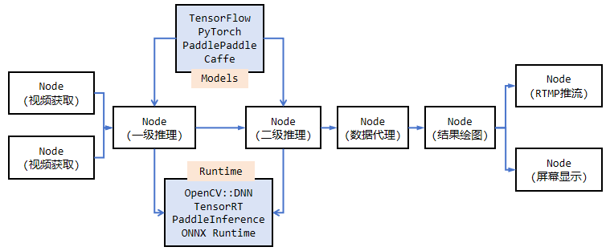

`VideoPipe`可用于以下场合:
1. 视频结构化
2. 图片搜索（相似度检索）
3. 人脸识别
4. 安防领域的行为分析（如交通事件检测）、reID相关应用

> 注意：<br>
> VideoPipe是一个让计算机视觉领域中模型集成更加简单的框架，它并不是像TensorFlow、TensorRT类似的深度学习框架。

https://github.com/sherlockchou86/video_pipe_c/assets/13251045/2cac8020-a4c4-4a7c-926b-a139a3b29161

https://github.com/sherlockchou86/video_pipe_c/assets/13251045/b1289faa-e2c7-4d38-871e-879ae36f6d50

https://github.com/sherlockchou86/video_pipe_c/assets/13251045/c0be8f6f-949a-4ab3-b0eb-9ac1496bee1d

## 主要功能
- 流读取。支持流行的协议，如udp（视频或图像）、rtsp、rtmp、文件（视频或图像）。
- 视频解码。支持基于opencv/gstreamer的视频解码（支持硬件加速）。
- 基于深度学习的推理。支持基于深度学习模型的多级推理，例如目标检测、图像分类、特征提取。你只需准备好模型并了解如何解析其输出即可。推理可以基于不同的后端实现，如opencv::dnn（默认）、tensorrt、paddle_inference、onnx runtime等，任何你喜欢的都可以。
- 屏幕显示（OSD）。支持可视化，如将模型输出绘制到帧上。
- 消息代理。支持将结构化数据（json/xml/自定义格式）以kafka/Sokcet等方式推送到云端、文件或其他第三方平台。
- 目标追踪。支持目标追踪，例如iou、sort跟踪算法等。
- 行为分析（BA）。支持基于追踪的行为分析，例如越线、停车判断。
- 录制。支持特定时间段的视频录制，特定帧的截图。
- 视频编码。支持基于opencv/gstreamer的视频编码（支持硬件加速）。
- 流推送。支持通过rtmp、rtsp（无需专门的rtsp服务器）、文件（视频或图像）、udp（仅限图像）、屏幕显示（GUI）进行流推送或结果展示。

## 主要特点

1. 可视化管道，对于调试非常有用。管道的运行状态会自动在屏幕上刷新，包括管道中每个连接点的fps、缓存大小、延迟等信息，你可以根据这些运行信息快速确定管道的瓶颈所在。
2. 节点之间通过智能指针传递数据，默认情况下是浅拷贝，当数据在整个管道中流动时无需进行内容拷贝操作。当然，如果需要，你可以指定深拷贝，例如当管道具有多个分支时，你需要分别在两个不同的内容拷贝上进行操作。
3. 你可以构建不同类型的管道，支持单通道或多通道的管道，管道中的通道是独立的。
4. 管道支持钩子（回调），你可以向管道注册回调以获取状态通知（参见第1项），例如实时获取某个连接点的fps。
5. VideoPipe中已经内置了许多节点类型，但是框架中的所有节点都可以由用户重新实现，也可以根据你的实际需求实现更多节点类型。
6. 支持动态操作管道，支持多线程并行操作，支持`热插拔`操作模式（管道无需先暂停，即插即用）。
7. 整个框架主要由原生C++编写，可在所有平台上移植。

## 帮助资料
- [sample code](./sample/README.md)
- [node table](./nodes/README.md)
- [how VideoPipe works](./doc/about.md)
- [how record works](./nodes/record/README.md)
- [environment for reference](./doc/env.md)
- :blush: wait for update...

## 扫码入群交流


## 依赖

平台
- Ubuntu 18.04 x86_64 NVIDIA rtx/tesla GPUs
- Ubuntu 18.04 aarch64 NVIDIA jetson serials device，tx2 tested
- Ubuntu 18.04 x86_64 Cambrian MLU serials device, MLU 370 tested (code not provided)
- Wait for your test

基础
- C++ 17
- OpenCV >= 4.6
- GStreamer 1.20 (Required by OpenCV)
- GCC >= 7.5

可选, 如果你需要实现自己的推理后端，或者使用除`opencv::dnn`之外的其他推理后端.
- CUDA
- TensorRT
- Paddle Inference
- ONNX Runtime
- Anything you like

[如何安装CUDA和TensorRT](./third_party/trt_vehicle/README.md)

[如何安装Paddle_Inference](./third_party/paddle_ocr/README.md)

## 如何编译和调试

1. 运行 `git clone https://github.com/sherlockchou86/video_pipe_c.git`
2. 运行 `cd video_pipe_c`
3. 运行 `mkdir build && cd build`
4. 运行 `cmake ..`
5. 运行 `make -j8`

编译完成后，所有的库文件存放在`build/libs`中，所有的Sample运行文件存放在`build/bin`中。在执行第4步的时候，可以添加一些编译选项：
- -DVP_WITH_CUDA=ON （编译CUDA相关功能，默认为OFF）
- -DVP_WITH_TRT=ON （编译TensorRT相关功能和Samples，默认为OFF）
- -DVP_WITH_PADDLE=ON （编译PaddlePaddle相关功能和Samples，默认为OFF）
- -DVP_BUILD_COMPLEX_SAMPLES=ON （编译高级Samples，默认为OFF）

比如需要开启CUDA和TensorRT相关的模块，可以运行 `cmake -DVP_WITH_CUDA=ON -DVP_WITH_TRT=ON ..`。如果只运行`cmake ..`，那么所有代码运行在CPU上。
```
# 开启全部
cmake -DVP_WITH_CUDA=ON -DVP_WITH_TRT=ON -DVP_WITH_PADDLE=ON -DVP_BUILD_COMPLEX_SAMPLES=ON ..
# 关闭全部（默认）
cmake ..
```

如果要运行编译生成的Samples，先下载模型文件和测试数据：

1. [谷歌网盘下载测试文件和模型](https://drive.google.com/drive/folders/1v9dVcR6xttUTB-WPsH3mZ_ZZMzD4wG-v?usp=sharing)
2. [百度网盘下载测试文件和模型](https://pan.baidu.com/s/1jr2nBnEDmuNaM5DiMjbC0g?pwd=nf53)

将下载好的目录（名称为vp_data）放在任何位置（比如放在`/root/abc`下面），然后在`同一目录`下运行Sample，比如在`/root/abc`下面执行命名：`[path to video_pipe_c]/build/bin/1-1-1_sample`即可运行1-1-1_sample。

> 注意： `./third_party/` 下面都是独立的项目，有的是header-only库，被VideoPipe直接引用；有的包含有cpp文件，可以独立编译或运行，VideoPipe依赖这些库，在编译VideoPipe的过程中会自动编译这些库。这些库也包含自己的Samples，具体使用方法可参见对应子目录下的README文件.

## 如何使用 

1. 先将VideoPipe编译成库，然后引用它.
2. 或者直接引用源代码，然后编译整个application.

下面是一个如何构建Pipeline然后运行的Sample(请先修改代码中的相关文件路径):
```c++
#include "../nodes/vp_file_src_node.h"
#include "../nodes/infers/vp_yunet_face_detector_node.h"
#include "../nodes/infers/vp_sface_feature_encoder_node.h"
#include "../nodes/osd/vp_face_osd_node_v2.h"
#include "../nodes/vp_screen_des_node.h"
#include "../nodes/vp_rtmp_des_node.h"
#include "../utils/analysis_board/vp_analysis_board.h"

/*
* ## 1-1-N sample ##
* 1 video input, 1 infer task, and 2 outputs.
*/

int main() {
    VP_SET_LOG_INCLUDE_CODE_LOCATION(false);
    VP_SET_LOG_INCLUDE_THREAD_ID(false);
    VP_LOGGER_INIT();

    // create nodes
    auto file_src_0 = std::make_shared<vp_nodes::vp_file_src_node>("file_src_0", 0, "./test_video/10.mp4", 0.6);
    auto yunet_face_detector_0 = std::make_shared<vp_nodes::vp_yunet_face_detector_node>("yunet_face_detector_0", "./models/face/face_detection_yunet_2022mar.onnx");
    auto sface_face_encoder_0 = std::make_shared<vp_nodes::vp_sface_feature_encoder_node>("sface_face_encoder_0", "./models/face/face_recognition_sface_2021dec.onnx");
    auto osd_0 = std::make_shared<vp_nodes::vp_face_osd_node_v2>("osd_0");
    auto screen_des_0 = std::make_shared<vp_nodes::vp_screen_des_node>("screen_des_0", 0);
    auto rtmp_des_0 = std::make_shared<vp_nodes::vp_rtmp_des_node>("rtmp_des_0", 0, "rtmp://192.168.77.60/live/10000");

    // construct pipeline
    yunet_face_detector_0->attach_to({file_src_0});
    sface_face_encoder_0->attach_to({yunet_face_detector_0});
    osd_0->attach_to({sface_face_encoder_0});

    // auto split
    screen_des_0->attach_to({osd_0});
    rtmp_des_0->attach_to({osd_0});

    file_src_0->start();

    // for debug purpose
    vp_utils::vp_analysis_board board({file_src_0});
    board.display();
}
```
上面代码运行后，会出现3个画面:
1. 管道的运行状态图，状态自动刷新
2. 屏幕显示结果（GUI）
3. 播放器显示结果（RTMP）


## 可以做哪些事情
### 行为分析 & 图片视频搜索

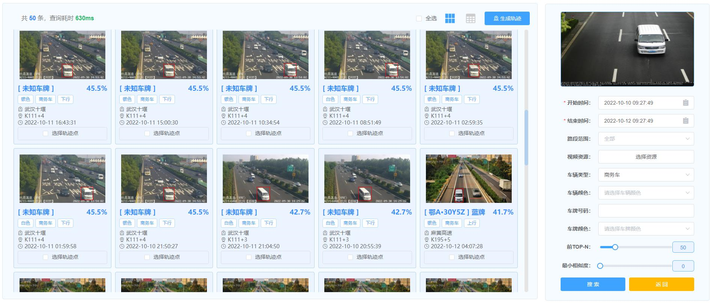

## 案例原型
|id|sample|screenshot|
|--|--|--|
|1|1-1-1_sample||
|2|1-1-N_sample||
|3|1-N-N_sample||
|4|N-1-N_sample|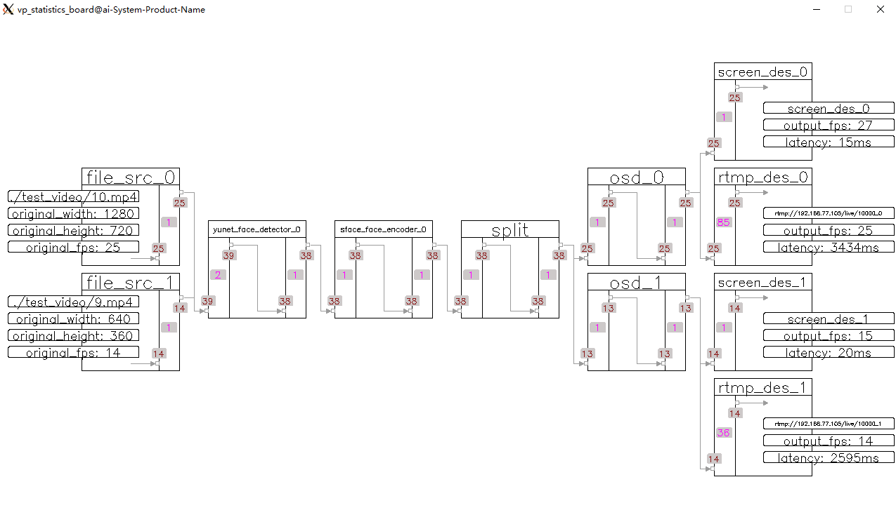|
|5|N-N_sample||
|6|paddle_infer_sample||
|7|src_des_sample||
|8|trt_infer_sample||
|9|vp_logger_sample|-|
|10|face_tracking_sample|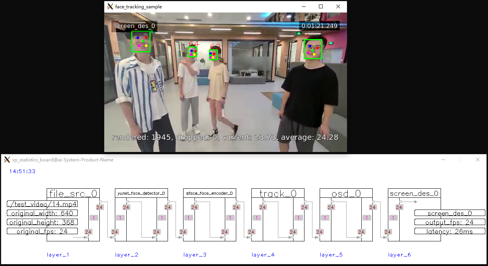|
|11|vehicle_tracking_sample|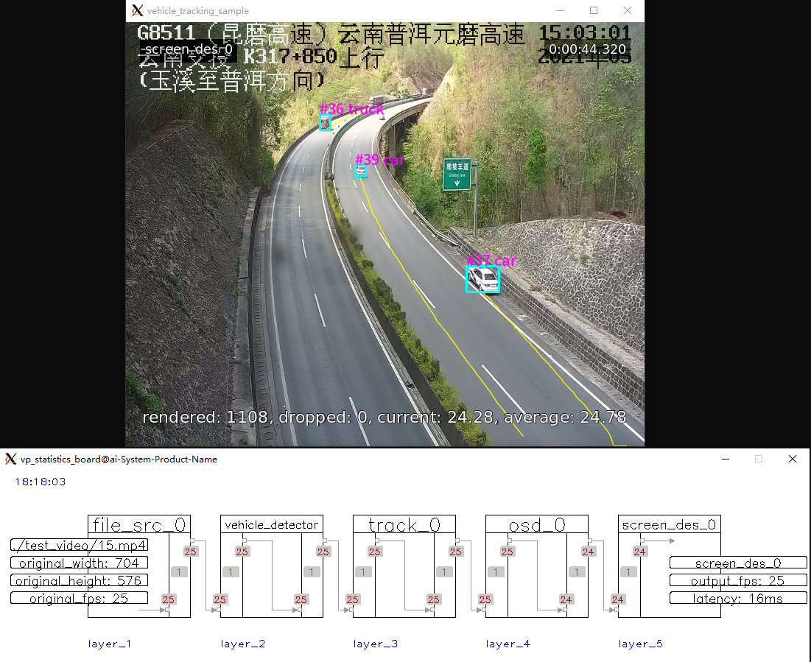|
|12|interaction with pipe sample|--|
|13|record_sample|--|
|14|message_broker_sample & message_broker_sample2||
|15|mask_rcnn_sample||
|16|openpose_sample||
|17|enet_seg_sample||
|18|multi detectors and classifiers sample||
|19|image_des_sample|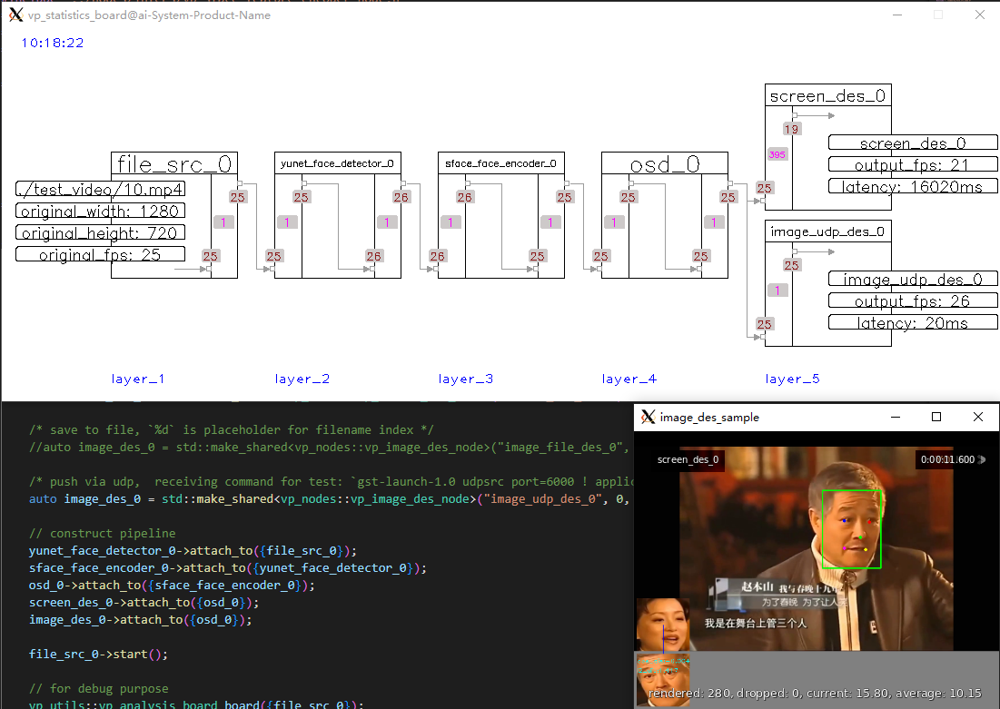|
|20|image_src_sample||
|21|rtsp_des_sample|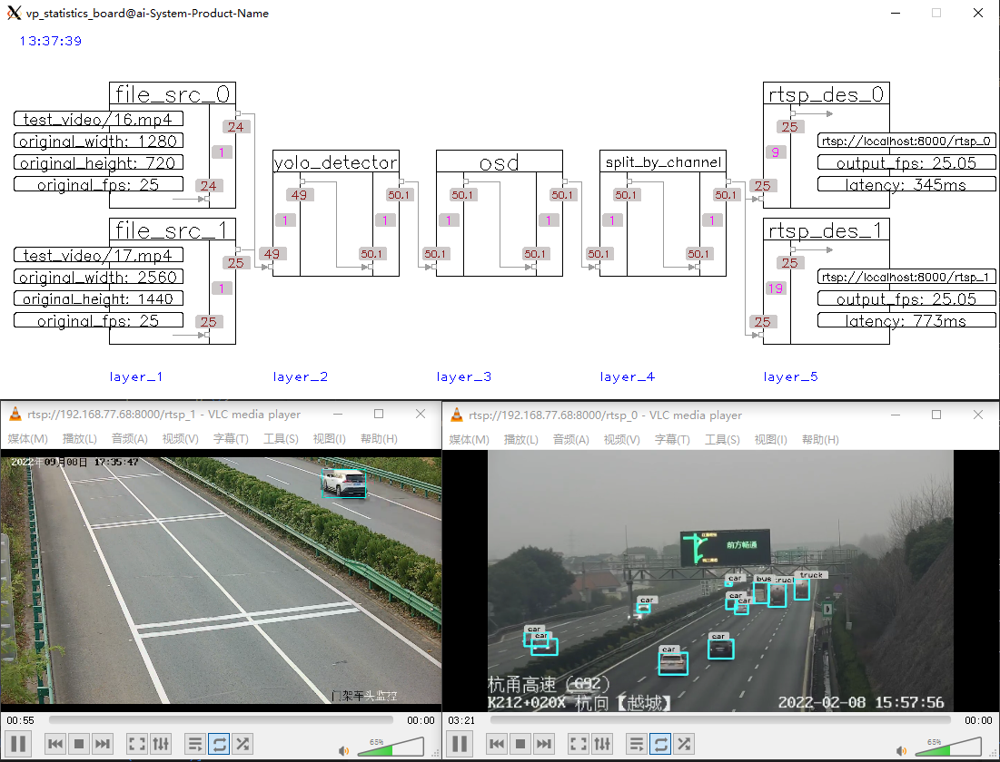|
|22|ba_crossline_sample||
|23|plate_recognize_sample|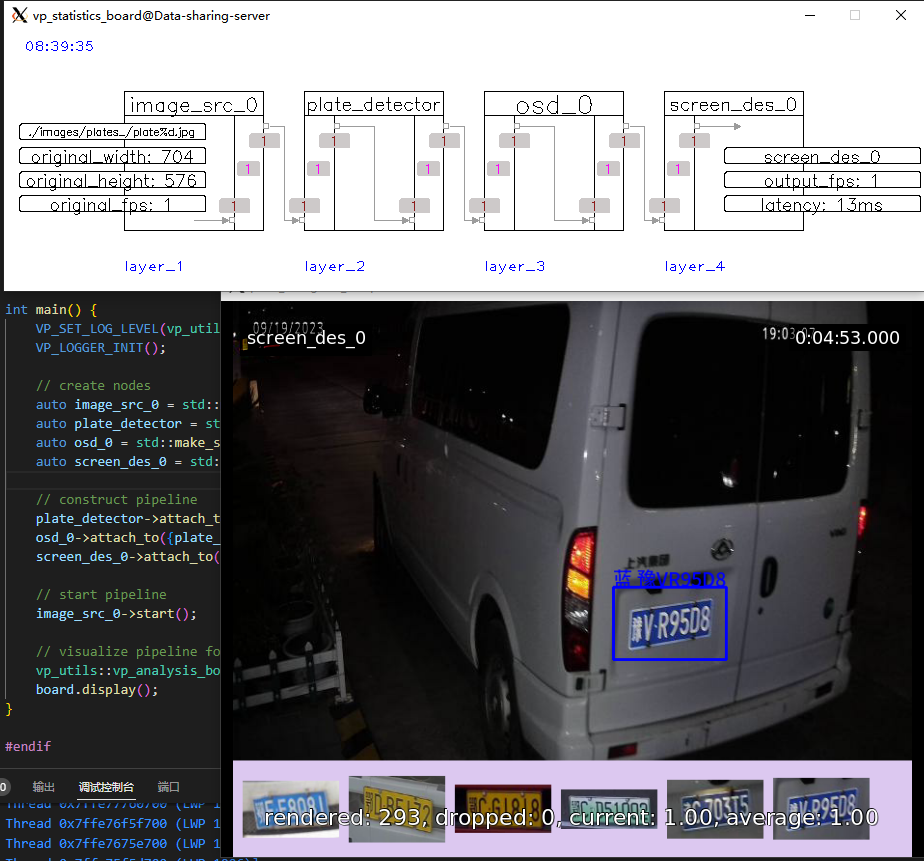|
|24|vehicle body scan sample||
|25|body scan and plate detect sample||
|26|app_src_sample||
|27|vehicle cluster based on classify encoding sample|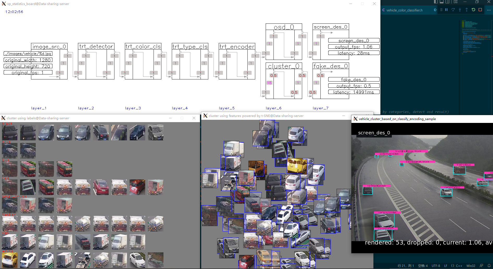|
|28|ba_stop_sample||
|29|behaviour analysis|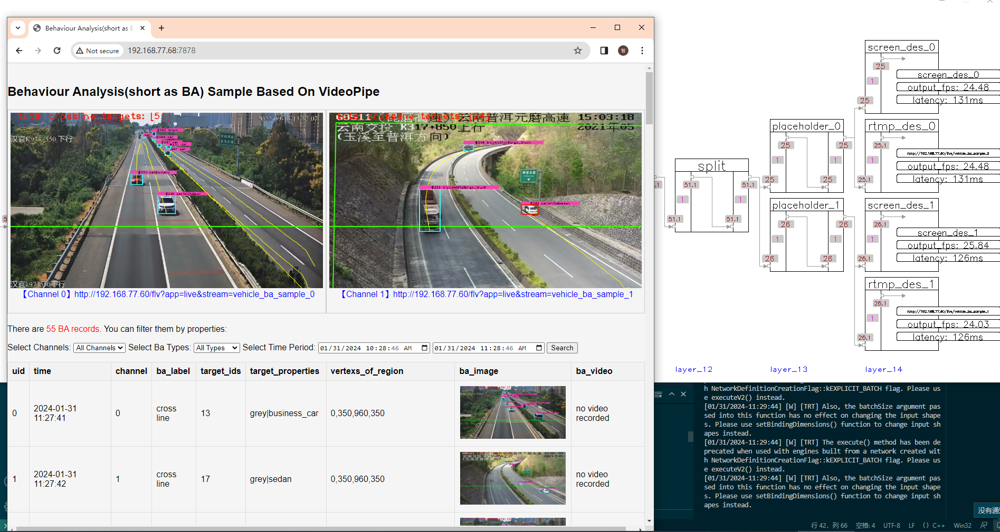|
|30|similiarity search|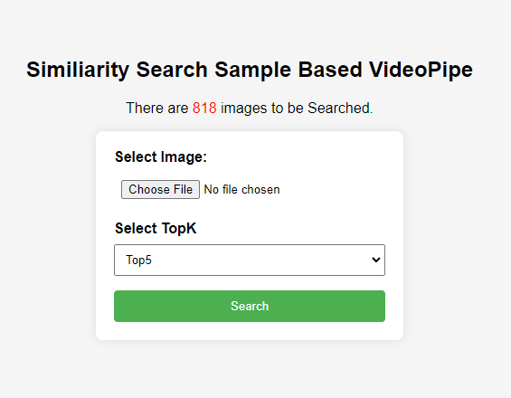|
|31|property and similiarity search|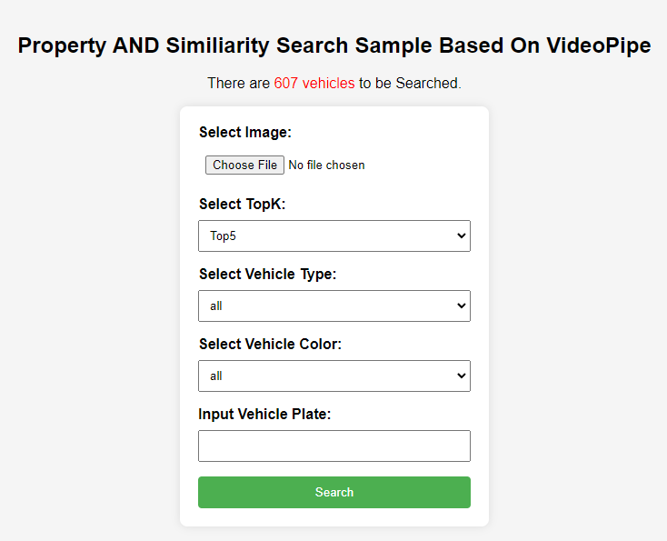|
|32|ba_jam_sample|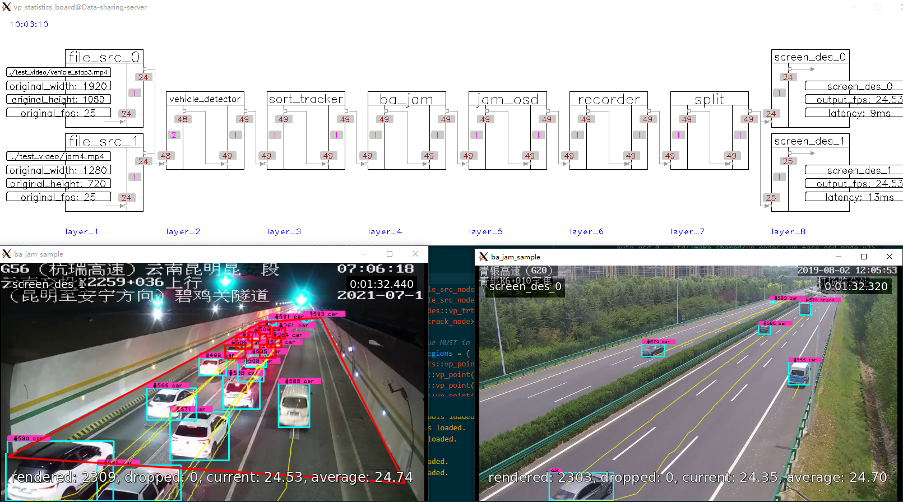|
|33|face recognize||
