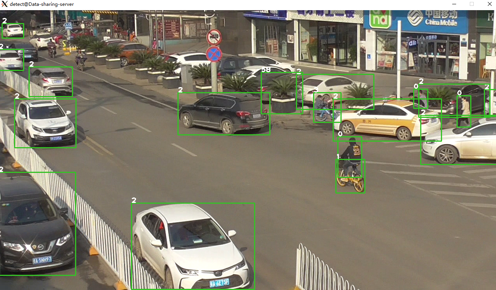

# trt_yolov8 #

detection/segmentation/pose_estimation based on `yolov8`, codes come from [tensorrtx](https://github.com/wang-xinyu/tensorrtx/tree/master/yolov8), with some modifications.


## How to generate plan file(trt/engine) from pytorch models ?
```
.pt --> .wts --> .trt/.engine
```

1. download default `.pt` models of `yolov8/n/s/m/...(det/seg/pose)` from [github](https://github.com/ultralytics/assets/releases) (or trained by yourself)
2. convert `.pt` to `.wts` using `samples/gen_wts.py`
3. convert `.wts` to `.engine` using `samples/trt_yolov8_wts_2_engine`

### .pt -> .wts ###
`python3 samples/gen_wts.py [-w] [.pt] [-o] [.wts] [-t] [detect/seg]`
```
python3 samples/gen_wts.py -w yolov8n.pt -o yolov8n.wts -t detect
python3 samples/gen_wts.py -w yolov8n-seg.pt -o yolov8n-seg.wts -t seg
python3 samples/gen_wts.py -w yolov8n-pose.pt -o yolov8n-pose.wts
python3 samples/gen_wts.py -w yolov8s.pt -o yolov8s.wts -t detect
python3 samples/gen_wts.py -w yolov8s-seg.pt -o yolov8s-seg.wts -t seg
python3 samples/gen_wts.py -w yolov8s-pose.pt -o yolov8s-pose.wts
...
```

### .wts -> .engine ###

`./trt_yolov8_wts_2_engine [-det/-seg/-pose] [.wts] [.engine] [n/s/m/l/x/n2/s2/m2/l2/x2/n6/s6/m6/l6/x6]`
```
./build/samples/trt_yolov8_wts_2_engine -det yolov8n.wts yolov8n.engine n
./build/samples/trt_yolov8_wts_2_engine -det yolov8s.wts yolov8s.engine s
./build/samples/trt_yolov8_wts_2_engine -seg yolov8n-seg.wts yolov8n-seg.engine n
./build/samples/trt_yolov8_wts_2_engine -seg yolov8s-seg.wts yolov8s-seg.engine s
./build/samples/trt_yolov8_wts_2_engine -pose yolov8n-pose.wts yolov8n-pose.engine n
./build/samples/trt_yolov8_wts_2_engine -pose yolov8s-pose.wts yolov8s-pose.engine s
...
```

> CUDA 11.1 + TensorRT 8.5 for this repository (tested)

## How to build trt_yolov8 ?
we can build trt_yolov8 separately.
> change the value of `kNumClass` in `include/config.h` to your classes number (80 by default for coco dataset) before building.
0. set the right library path and include path for TensorRT in `CMakeLists.txt`
1. `mkdir build && cd build`
2. `cmake ..`
3. `make -j8`

all lib files saved to `build/libs`, all samples saved to `build/samples`. please refer to videopipe about how to run samples for trt_yolov8.

## Sample screenshot (yolov8s/det/seg/pose trained by coco dataset from github) ##

### detection ###


### pose_estimation ###


### segmentation ###
